# 一、Item View（记录卡片视图） 是什么

## 1-1. 简介

| **ItemView** | 多维表格 Record展开后的一个抽屉视图，默认包括详情、评论、历史记录三个Tab。如右图所示。 |  |
| --- | --- | --- |
| **ItemView 扩展** | Itemview 支持通过插件，添加除历史记录、评论、详情以外的Tab View。如右图所示。 |  |

# 二、页面结构

## 2-1. 结构

Item view 插件的所有内容都被承载在多维表格的右侧面板中，其内容可由「标题栏」、「标签栏」和「自定义区域」组成，而「自定义区域」又可以分为「功能区」和「内容区」
**标题栏：必选，** 用于展示插件名称，承载部分功能入口和关闭功能，由多维表格提供；
**标签栏****：必选，** 用于展示，由多维表格提供；
**功能区：可选，** 用于承载组件的全局性操作，可自定义
**内容区：可选，** 用于展示插件的核心内容以及与内容相关的操作，可自定义
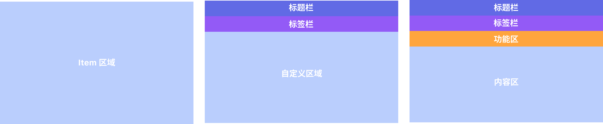

## 2-2. 布局

在页面布局设计上，比较建议采用上下布局，可以适配不同宽度的场景（适配规则的详情可看 [3-1 宽度尺寸适配](https://bytedance.feishu.cn/docx/AlJhddBJAowN9cxapvccTezUn7g#doxcnnSIUXVXXMWgIrVWT8XHS9f)），如果碰到功能操作比较多的情况，可以尝试拆解成浮动工具栏的方式或者拆到子级页面中，以保证在小尺寸情况下相关操作的可用性。

| 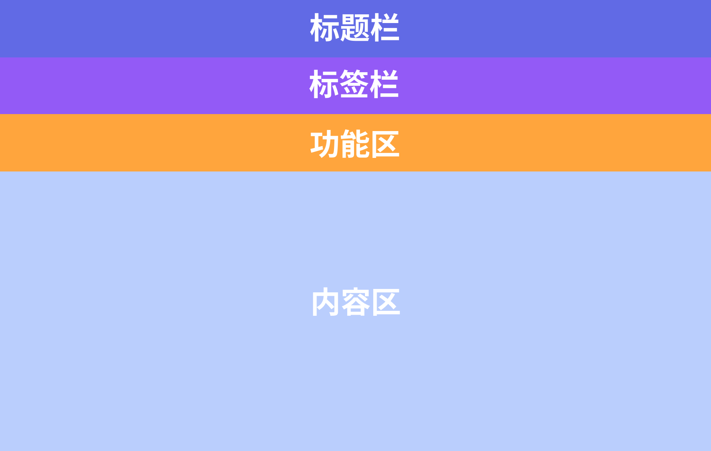 | 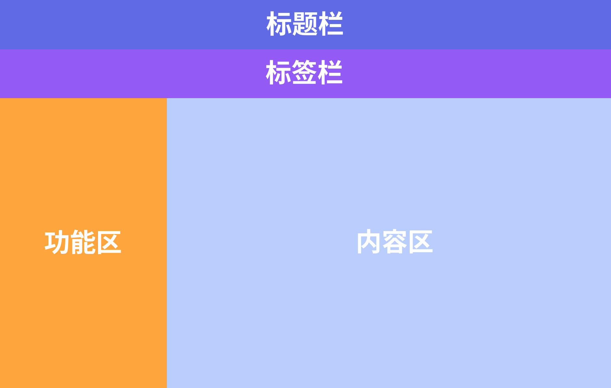 |\
|  |  |
| --- | --- |
| **正确：**  | **避免：**  |\
| 建议布局，可以较好的响应不同宽度尺寸环境 | 不太建议，在小尺寸下会只能显示一部分内容，需要做较多改造性的适配 |

### 2-1-1. 标题和标签

顶部栏是有多维表格统一提供，无需自行研发，设计资源：，其中「标题栏」由「标题」与「菜单入口」组成：
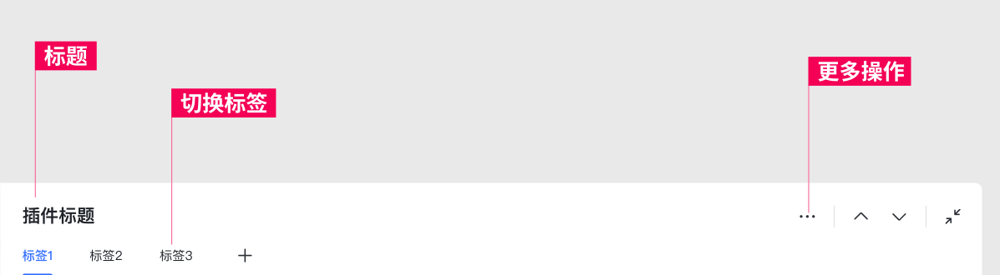
**标题：** 标题内容是字段的索引列字段的内容，为自动配合无需设计。
**标签：** 实质是插件的名称，需要专门配置。
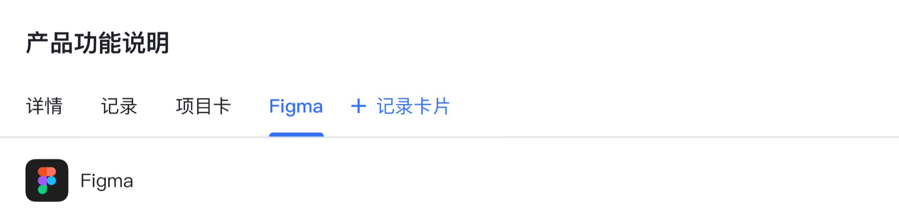

### 2-1-2. 自定义区域（wip）

在页面布局设计上，比较建议采用上下布局，可以适配不同宽度的场景（适配规则的详情可看 [3-1 宽度尺寸适配](https://bytedance.feishu.cn/docx/AlJhddBJAowN9cxapvccTezUn7g#doxcnnSIUXVXXMWgIrVWT8XHS9f)），如果碰到功能操作比较多的情况，可以尝试拆解成浮动工具栏的方式或者拆到子级页面中，以保证在小尺寸情况下相关操作的可用性。
还处于共创阶段，待补充..

## 2-3. 优秀案例（预留）

还处于共创阶段，待补充..
<br>

<br>

# 三、布局适配

## 3-1. 宽度尺寸适配

默认尺寸共分为 6 种，最小尺寸、小尺寸、中尺寸、大尺寸、较大尺寸、最大尺寸。面板支持用户自定义尺寸并可记忆，而内容的高度与窗口等高，支持窗口内滚动操作。

- **最小尺寸：** 固定宽度为 480 px
	
- **小尺寸：** 固定宽度为 600 px
	
- **中尺寸：** 默认宽度区间为 480-600 px
	
- **大尺寸：** 默认宽度区间为 640-900 px
	
- **较大尺寸：** 默认宽度区间为 720-1000 px
	
- **最大尺寸：** 默认宽度区间为 800-1460 px
	

> 备注：比如用户现在的宽度是 960 px ，抽屉宽度是 500 px，用户拉伸了浏览器到 1100 px，这时候抽屉宽度还是 500 px ，只有到达 1280 px，才变成默认的 640 px，所以在宽度达到下一个区间之前，都不用变化。另外，初始值是按默认宽度，如果用户自定义调整了宽度的话，就会记忆用户的宽度即：不管窗口大小是多少，都按照用户设置的宽度。


## 3-2. 跨平台适配

多维表格存在多种平台下的形态，其中最主要关注的是独立 Web 形态和在 Lark 下的 feed 形态，以下是相关界面的示意，需要特别关注的是在 Lark feed 形态下尺寸会偏小，其中很多二级面板的打开是互斥的，比如打开表管理面板等，可能会导致流程中断。

| Web 形态 | Lark feed 形态 |
| --- | --- |
|  |  |
| 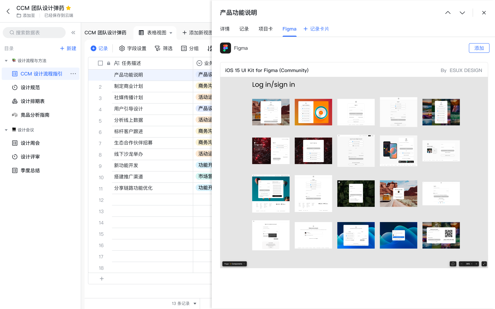 |  |

## 3-3. 页面/窗口打开规则

- **内部弹窗**
	- **避免页面跳转，需要在不离开整体页面的情况下提供信息和交互，之后可以快速回到之前的路径上，采用弹窗打开：** 在当前页面中，弹出一个独立的容器窗口，覆盖在整体页面之上，进行内容显示与操作。如新开系统级独立窗口打开，如打开PDF、图片、视频等；或在客户端内弹窗打开模态或非模态窗口，进行内容显示与操作。
		
- **子级页面**
	- **同一层级内容间的操作，或流程性的功能界面，采用当前页打开：** 在当前页面中进行内容显示与操作，保证了用户注意力的连续性。如导航栏的切换，或前后操作存在关联和影响，如按步骤推进。
		
- **外部页面**
	- **页面内容没有关联性，且从逻辑上没有从属关系，是相对独立的场景，采用新页面打开：** 存在于需要保持原始界面完整展示，同时打开新页面的场景。如在 Item view 内新开一个独立的标签页面；或者在浏览器新开一个独立的标签页面，如打开外部地址链接、打开文档等。
		

<br>

# 四、基础样式

## 4-1. 色彩

现有的色彩 figma 组件：[颜色样式](https://www.figma.com/file/TMk9nXkW8oSR7aYmnZiMym/Bitable-%E5%BC%80%E6%94%BE%E7%94%9F%E6%80%81%EF%BC%88wip%EF%BC%89?node-id=1%3A1050&t=88xK1i8vNDIsAbzw-1)；

在多维表格中会有两种色彩模式：Light Mode - 亮模式、Dark Mode-暗模式，所以在开发插件过程中需要使用飞书的色板，并按照对应规则适配两种色彩模式，以保持多维表格的整体体验的统一，详情请查看[LM 与 DM 适配规则](https://bytedance.feishu.cn/docs/doccnmmoQWpZVjUNT2QcwuVmZCh)

| Light Mode | Dark Mode |
| --- | --- |
|  | 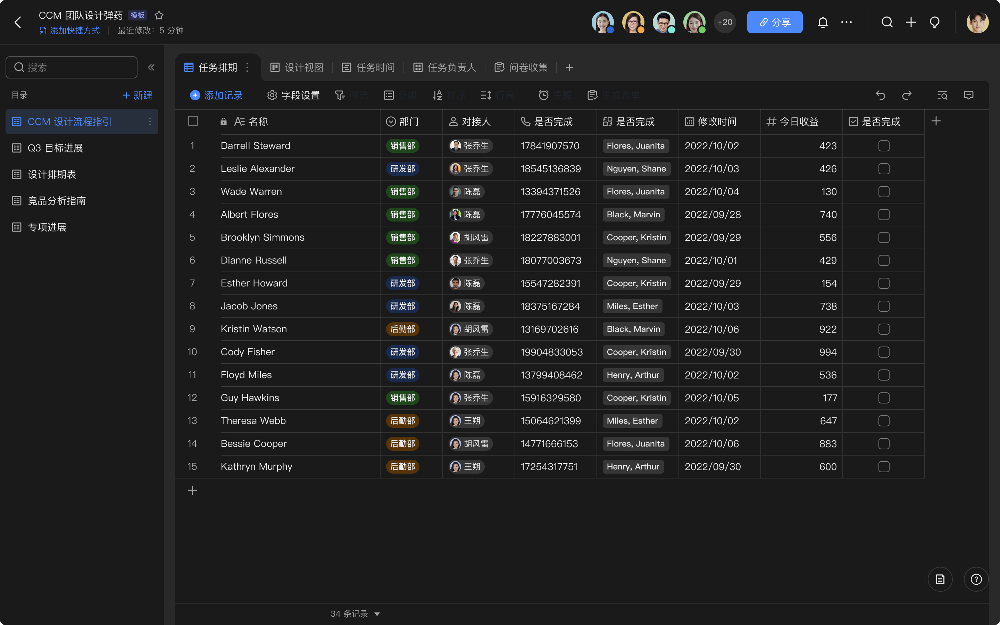 |

颜色能传达内容的重要性和关联，并为用户提供指导，帮助他们完成任务。我们将提供的色板分为：功能色、中性色，其中中性色针对文字、图标、背景、描边、分割线以及交互状态提供颜色规范，可以根据实际场景选择合适的颜色，确保呈现给用户的信息具有足够的视觉对比度。
**功能色**
功能色用来标识界面中的信息状态，在选取时需要遵循用户的认知习惯。在相同产品体系下需要保持一致性，在选取时需要遵循用户的认知习惯，例如: 语义红色代表错误、橙色代表警示、绿色代表成功、蓝色代表强调/可点击文字链等。
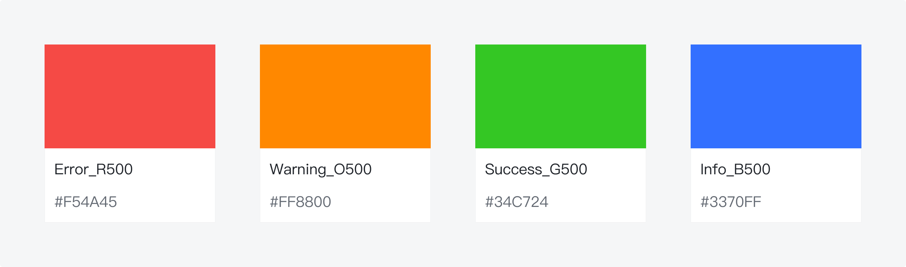
**中性色**
中性色主要应用于文字与通用元素部分，如背景、描边、分割线等。选择中性色时需要考虑深、浅背景下的明度对比差异性。合理地选择中性色能够令页面信息具备良好的主次关系，保障界面元素的可识别性。Block 的灰阶色板一共包含了从白到黑的14个颜色，其中黑、白为无彩色，灰色中融入一定量蓝色，能为界面提供更好的阅读体验。
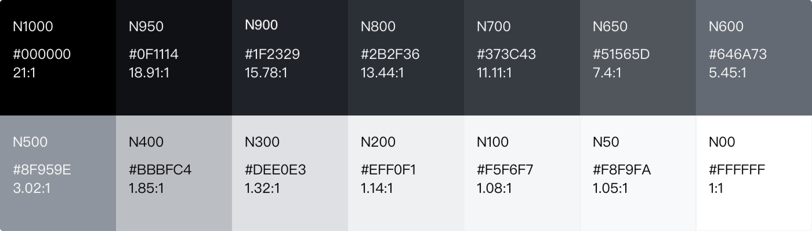
**文字颜色**
同一页面文字颜色不应超过三种，如遇到特殊场景，最多增加到四种。以下为不同类型文本配色的使用规范：

- 一级标题、正文使用 N900
	
- 二级标题、二级正文使用 N600
	
- 输入框引导语、提示文字、辅助信息使用 N500
	
- 在灰/白色背景下的文字链 Disable 状态使用 N400
	

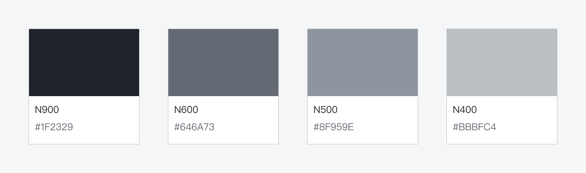
**图标颜色**
图标颜色需要有明确的区分度，根据场景与功能类型的不同，使用4个色阶进行区分，使用规则如下：

- 一级图标使用 N800
	
- 二级图标使用 N600
	
- 三级图标、表意图标、 tab 未选中图标使用 N500
	
- Disable 状态使用 N400
	

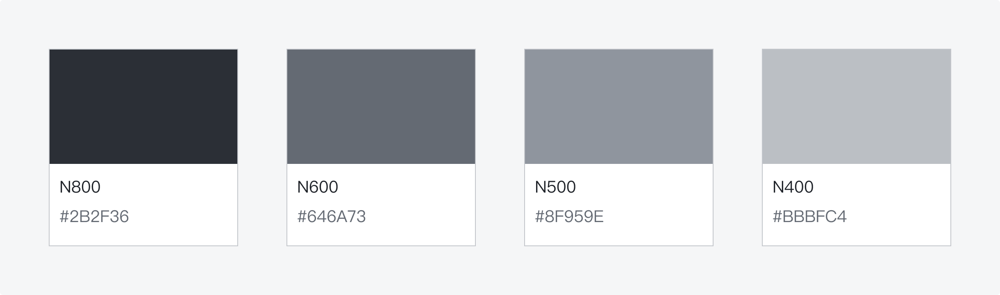
**背景颜色**
背景色用于协调界面层级关系，常规模式下的背景色值建议限定为 N50、N100、N200 三种。
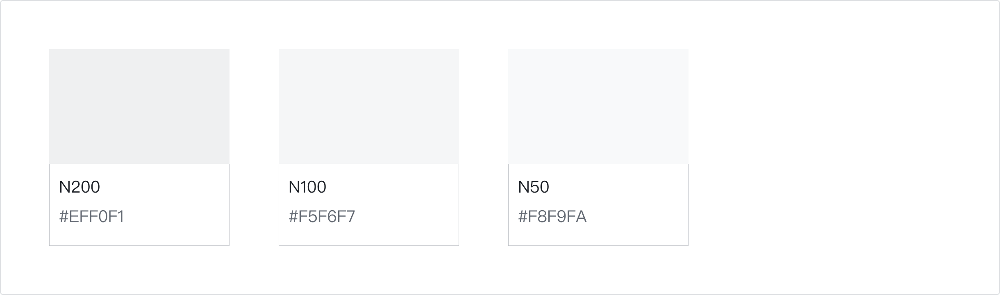
**描边颜色**

- 可交互控件（如输入框，选择器等）描边颜色 N400
	
- 卡片描边颜色 N300
	

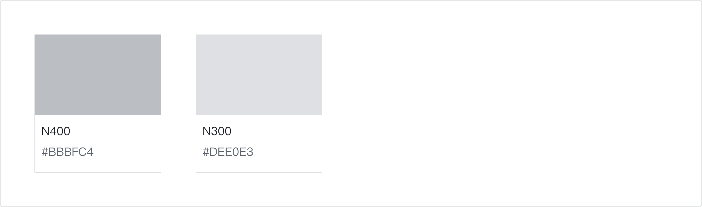
**分割线****和交互状态色**

- 分割线：N900，15%透明度
	
- Hover态：N900，10%透明度
	
- Press按压态：N900，15%透明度
	

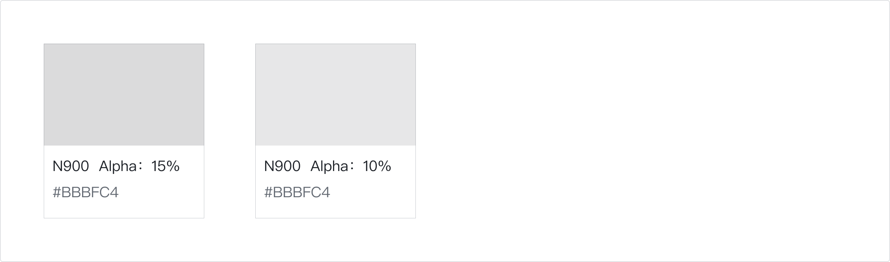
<br>

## 4-2. 图标

> 使用字节开源图标库 [IconPark](https://iconpark.bytedance.com/) ，如果需要独立绘制建议按照以下基础样式的规范来进行：

为了保证较好的适配性，图标尺寸需要是 4 的倍数，建议采用24\*24px的作为图标绘制的统一基础删格尺寸，并且在设计表达上**简洁直观**，避免复杂的结构，保证图标**表意清晰**，确保在各个尺寸下图标的**可读性**和**识别性**。具体的原则分别为：

|  ||
| --- | --- | --- |
| **垂直矩形：**  | **水平矩形：**  |\
| 标准尺寸：18×22px | 标准尺寸：22×18px |\
| 宽度容差范围：18~20px | 高度容差范围： 18~20px |
| 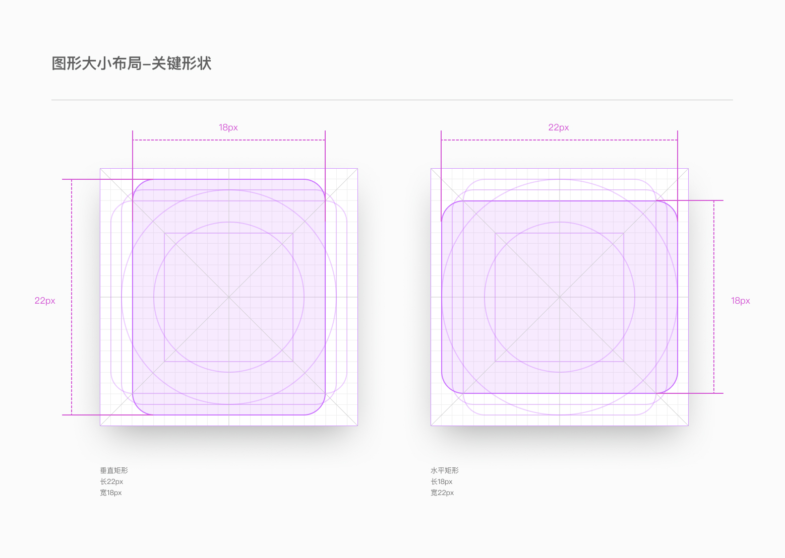 ||\
||
| **垂直矩形：**  | **水平矩形：**  |\
| 标准尺寸：18×22px | 标准尺寸：22×18px |\
| 宽度容差范围：18~20px | 高度容差范围： 18~20px |

推荐：图标线条采用 **2px** 宽度绘制，包括曲线、内部笔画、外部笔画等。

| 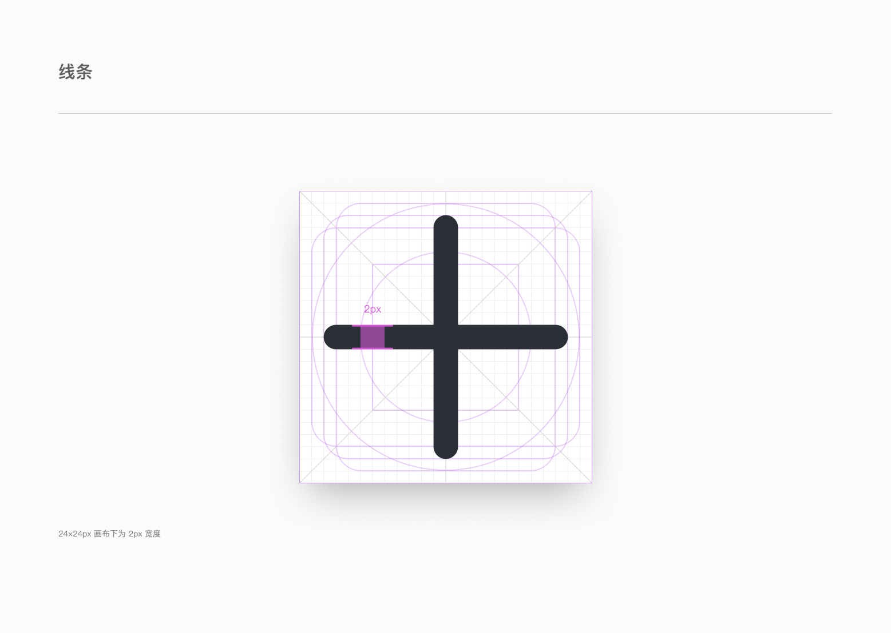 |
| --- |
| 24×24px 画布下为 **2px** 宽度； |

**圆角值：** 

| 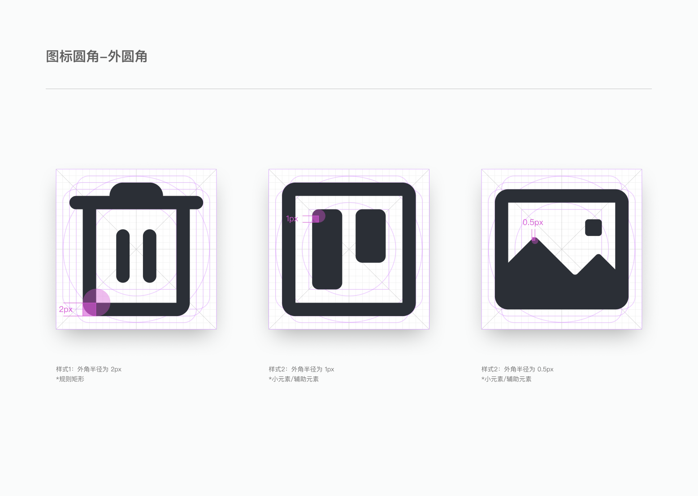 |||
| --- | --- | --- | --- | --- |
| 样式1：外角半径为 2px | 样式2：外角半径为 1px | 样式3：外角半径为 0.5px |
| 单独大元素 | 搭配小元素/辅助元素 | 搭配小元素/辅助元素 |
| 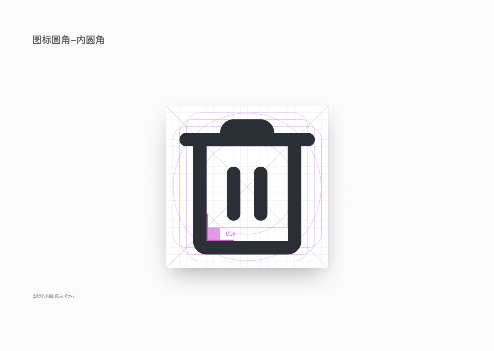 |||
| 内角半径为 0px（直角） |||

## 4-3. 字体

飞书的字体是由统一的参数控制，建议插件也遵循相关规范并引用里面的字体，保证跨平台的字体呈现能保持一致，详情可见：[字体样式 figma](https://www.figma.com/file/TMk9nXkW8oSR7aYmnZiMym/Bitable-%E5%BC%80%E6%94%BE%E7%94%9F%E6%80%81%EF%BC%88wip%EF%BC%89?node-id=1%3A4622&t=88xK1i8vNDIsAbzw-1)

Lark 的字体家族中优先使用系统默认的界面字体，同时提供了一套利于屏显的备用字体库，来维护在不同平台以及浏览器的显示下，字体始终保持良好的易读性和可读性，建议开发者同样使用这套字体规则以保证兼容性。

```JavaScript
中英文环境统一成：font-family:-apple-system,BlinkMacSystemFont,Helvetica Neue,Tahoma,PingFang SC,Microsoft Yahei,Arial,Hiragino Sans GB,sans-serif,Apple Color Emoji,Segoe UI Emoji,Segoe UI Symbol,Noto Color Emoji;
日文环境下统一成：font-family:"ヒラギノ角ゴ Pro W3", "Hiragino Kaku Gothic Pro", "Yu Gothic UI", "游ゴシック体", "Noto Sans Japanese",“Microsoft Jhenghei UI”,“Microsoft Yahei UI”,"ＭＳ Ｐゴシック", Arial, sans-serif,Apple Color Emoji,Segoe UI Emoji,Segoe UI Symbol,Noto Color Emoji;
```

**字体大小**
字阶在无形中区分了内容的主次，决定了内容的节奏与秩序之美。行高决定了文字的留白空间，配合字阶展示字体的最佳视觉效果。如无特殊情况请严格按照以下字号行高规范使用。
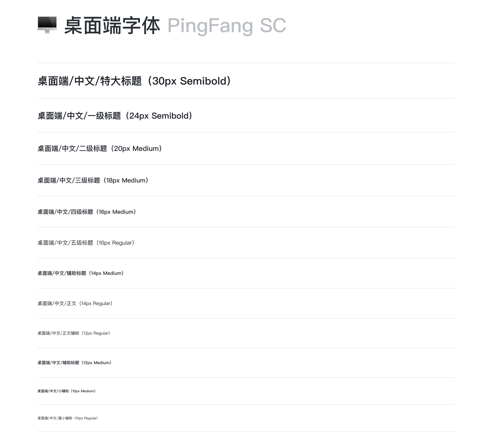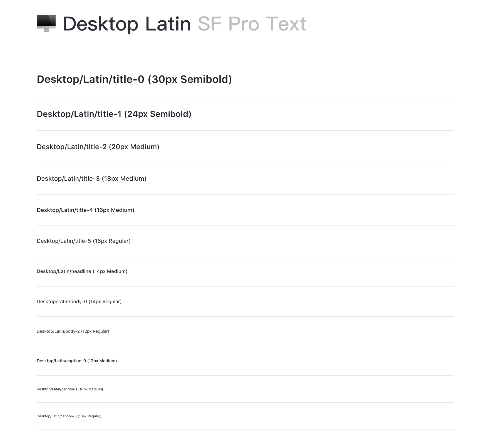

<br>

# 五、 基础组件规范

## 5-1. 字段

多维表格的字段是基础的要素，在插件中如果有涉及，就必须要沿用现有的字段表示方式，主要包括它的图标和文字名称，同时也要避免出现某操作的图标或者语意特别像某字段。


## 5-2. 按钮

按钮用于执行用户在交互流程中触发指令，提交更改或完成的即时操作，详情可见 [按钮 figma](https://www.figma.com/file/TMk9nXkW8oSR7aYmnZiMym/Bitable-%E5%BC%80%E6%94%BE%E7%94%9F%E6%80%81%EF%BC%88wip%EF%BC%89?node-id=88%3A161650&t=88xK1i8vNDIsAbzw-1)

按钮控件类型主要分为7种，分别为主要按钮、次要按钮、危险按钮、文字按钮、悬浮按钮、图标按钮和幽灵按钮

其中基础按钮的组成要素分为：

1. **容器背景** 用于承载这个按钮的容器背景；
	
2. **文本** 传达指令预期效果，编辑按钮文本时，尽量使用用户能够通过文本预测到触发此按钮的效果；
	
3. **容器边框** 用于承载此按钮的容器边框；
	
4. **图标** 可以帮助用户快速定位到这个动作，起到强调作用；
	

**按钮设计的基础规则：** 

- **按钮圆角**：4px
	
- **按钮间距**：间距遵循 4 的倍数。主要按钮、次要按钮、危险按钮之间间距为 12px。文字按钮之间间距为 16px，图标按钮之间间距为 12px，文字按钮与主要按钮/次要按钮之间间距为16px。
	
- **按钮文字**：不允许换行展示文字。
	
- **按钮状态：** 按钮提供 6 种响应状态，来表示按钮的交互反馈
	- Normal 常规状态：表示按钮可用
		
	- Hover 悬浮状态（桌面端特有）：表示按钮的可交互性
		
	- Focus 获焦状态 （桌面端特有）：表示按钮为长期选择态，可取消获焦
		
	- Press 点击状态：表示已按下按钮
		
	- Disable 禁用状态：声明操作可用但已被禁用
		
	- Loading 加载状态：声明操作行为已发生但还未生效
		
		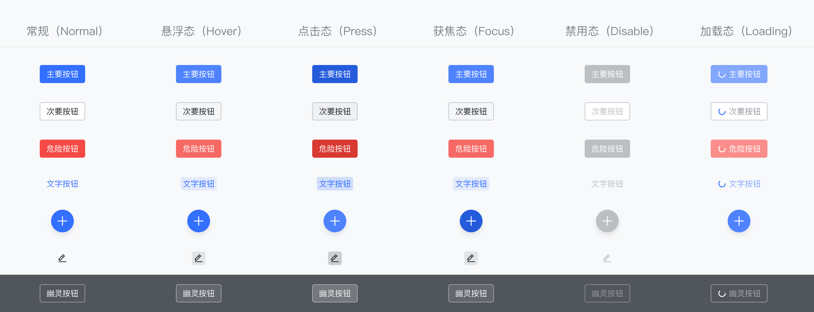
		

<br>

- **按钮大小：** 
	- **大尺寸**：最小尺寸 40px\*96px。左右间距小于 16px，按钮内容根据左右间距值来自适应
		
	- **中等尺寸**：最小尺寸 32px\*80px。左右间距小于 12px，按钮宽度根据左右间距值来自适应
		
	- **小尺寸**：最小尺寸 28px\*48px，左右间距小于 8px，按钮内容根据左右间距值来自适应
		
	- **特小尺寸**：最小尺寸24\*48px，左右间距小于 8px，按钮内容根据左右间距值来自适应
		
	  备注：按钮文字建议 20 个字符以内。按钮高度超出 40px 都属于特殊按钮，需要按照 4 的倍数关系递增递减，如 48px
	
	

<br>

## 5-3. 提示

提示分为 3 种分别为：常驻提示、临时提示和弹窗提示，详情请看：[提示 figma](https://www.figma.com/file/TMk9nXkW8oSR7aYmnZiMym/Bitable-%E5%BC%80%E6%94%BE%E7%94%9F%E6%80%81%EF%BC%88wip%EF%BC%89?node-id=2%3A28978&t=88xK1i8vNDIsAbzw-1)

|  | 信息量 | 优先级 | 信息结构 | 停留时间 | 用户操作 |
| --- | --- | --- | --- | --- | --- |
| **临时提示** **Toast** | **`少量`** | **`轻量`** | 标题+操作 | **短暂出现：** 会自动消失，用户也可以点击关闭 | 可选，常规情况下自动消失 |
| **常驻提示** **Notice** | **`适中`** | **`中等`** | 标题+描述 | **始终展现：** 不会自动消失。特殊场景下用户可点击关闭 | 可选，提示会一直保留，直到被用户主动关闭或者解决了导致出现常驻提示的条件才会消失 |\
|||||\
|||| - 大多数场景下只有描述 |\
|||| 	 |\
|||| - 长文本状态下推荐增加标题 |
| **弹窗** | **`较多`** | **`高优`** | 标题+描述+补充信息 | **始终展现：** 直到用户进行确认，关闭等操作为止。 | 必选，对话框会阻止应用程序使用，直到用户执行对话框操作或退出对话框才会消失 |\
| **Dialog** ||||

1. **临时提示****：** 
	

| 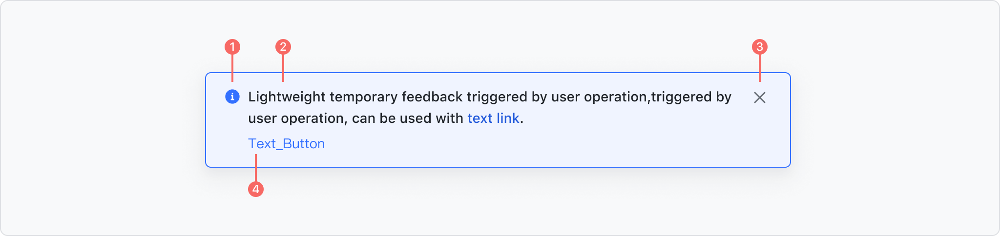 ||
| --- | --- | --- |
| 1. **图标：** 帮助用户快速识别信息的属性类别，起强调作用，图标可自定义； ||\
| 	 |\
| 2. **文本信息****\*****：** 应简短且清晰、明确，传递最重要的信息，可包含文字链； （**\****为必选项）* |\
| 	 |\
| 3. **关闭按钮：** 需要用户手动关闭或提示时间较久时使用（如文本超过20个中文字符时）； |\
| 	 |\
| 4. **文字按钮：** 简洁明了，明确告知用户下一步的操作，按钮数量建议不超过两个。 |\
| 	 |\
| 5. **显示位置：** 页面内居中显示，距离顶部间距为 32 px； |\
| 	 |\
| 6. **显示时长：**  |\
| 	1. **无操作** |\
| 		1. 无操作时建议至少4s后自动关闭； |\
| 			 |\
| 		2. 根据文本字数与场景自定义生效时长，最短3s，最长8s，字符越多时间越长； |\
| 			 |\
| 		3. 0-40个中文字符时，建议时长为3-5s； |\
| 			 |\
| 		4. 40-80个中文字符时，建议时间6s-8s。 |\
| 			 |\
| 	2. **有操作** |\
| 		1. 有操作时建议至少6s后自动关闭； |\
| 			 |\
| 		2. 根据文本字数与场景自定义生效时长，最短4s，最长10s，字符越多时间越长； |\
| 			 |\
| 		3. 0-40个中文字符时，建议时长为4-6s； |\
| 			 |\
| 		4. 40-80个中文字符时，建议时间6s-10s。 |\
| 			 |\
| 	3. **Hover 对生效时长的影响：** 鼠标悬停在 Toast 上，Toast 取消计时，鼠标离开后，Toast重新计时。 |\
| 		 |\
| 	4. **不自动消失：** 特定场景下，如：Toast 绑定了某加载中的事件，生效时间可能会无限拉长，呈现出持续生效的状态，不会自动消失，直到被用户主动关闭或者解决问题才会消失。 |\
| 		 |\
| 	5. **多条显示：** 默认同时显示两个，支持自定义 Max count； |\
| 		- **反馈信息完全相同的** **Toast****：** 同时多次触发时建议合并为一条集中展示，避免多条同类反馈干扰用户； |\
| 			 |\
| 		- **顺序：** 多条同时提示时，按照触发的时间先后在页面上方依次显示（最新在下方弹出）。超过最大显示数量时， 最早的消息会被挤掉（无论是否常驻或生效中）。 |
| 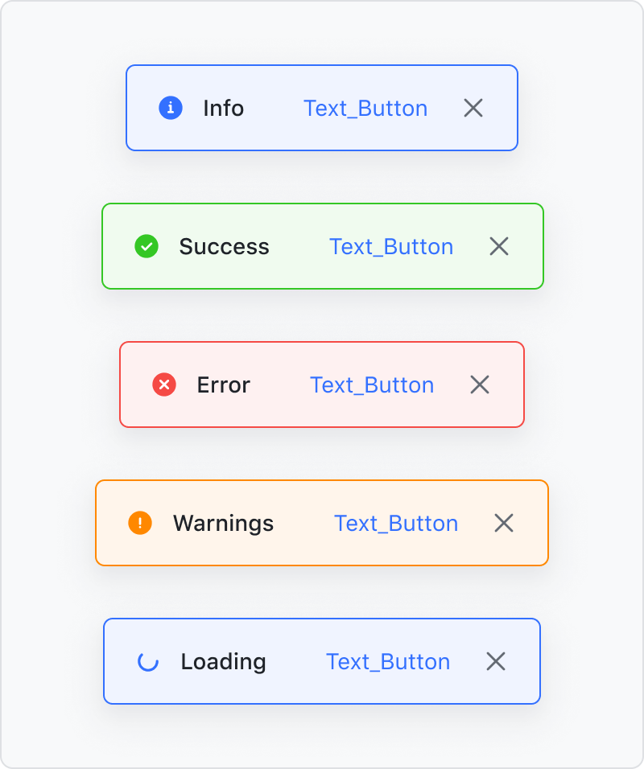 | **类型：** 按语义和状态分为五种类型，分别是普通提示 info、成功提示 success、错误提示 error、警告提示 warning、加载中 loading；且不支持拓展类型及自定义颜色。 |\
|||\
|| 1. **普通提示**：展示背景条件、任务进程、操作提示、内容陈述、规范要求、当前状态等客观内容； |\
|| 	 |\
|| 2. **成功提示**：展示完成操作的成功状态； |\
|| 	 |\
|| 3. **错误提示**：展示报错内容，如同时满足几个报错条件，建议整体报错； |\
|| 	 |\
|| 4. **警告提示**：展示可能会导致某种后果的警示性内容； |\
|| 	 |\
|| 5. **加载中：** 用于提示某信息正在加载的状态。 |\
|| 	 |\
|||\
|||

2. **常驻提示****：** 
	

| 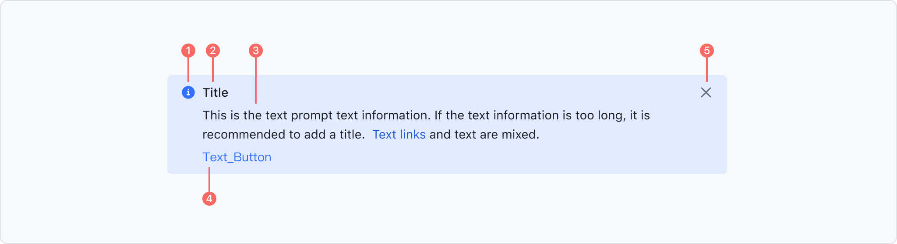 ||
| --- | --- | --- |
| 1. **图标：** 帮助用户快速识别提示的属性类别，起到强调作用； ||\
| 	 |\
| 2. **标题：** 标题文本，长文本提示建议增加标题； |\
| 	 |\
| 3. **正文信息：**  |\
| 	1. **\*** 传达一段清晰且明确的信息，不阻碍用户操作的同时吸引用户注意力 **；****（****\******为必选项）*** |\
| 		 |\
| 	2. 文字链接：与文本混排的链接，点击可跳转； |\
| 		 |\
| 4. **文字按钮：** 常驻提示的操作，主要为文字按钮； |\
| 	 |\
| 5. **关闭按钮：** 用户主动关闭，关闭后不影响其他操作。 |\
| 	 |\
| 6. **显示位置：** 与当前页面相关联的信息，处于顶部栏、一级标题下方，内容信息上方，详见 figma 内的示意； |\
| 	 |\
| 7. **显示宽度：** 非通栏，与内容模块等宽（100%width ）；通栏，通常应用在页面级别和系统级别。 |\
| 	 |\
||\
||
| 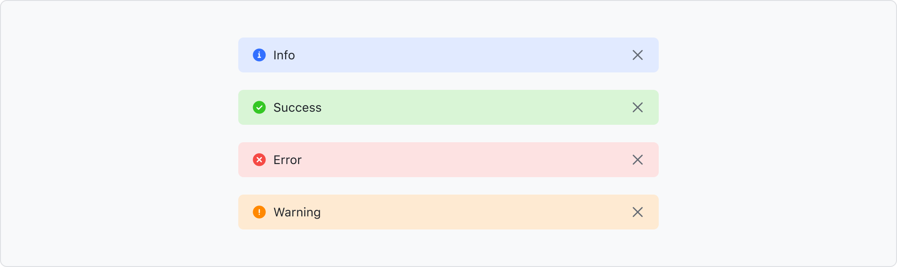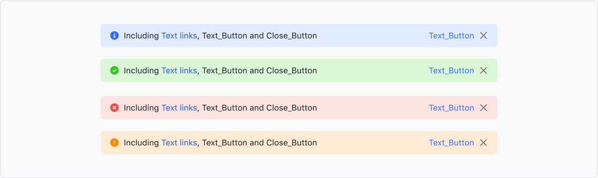 ||
| 按语义分为四种类型，分别是普通提示 Info、成功提示 Success、错误提示 Error、警告提示 Warning。 ||\
||\
| - **普通提示**：建议展示背景条件、规范要求、当前状态等客观内容。 |\
| 	 |\
| - **成功提示**：展示完成操作后的成功状态。 |\
| 	 |\
| - **错误提示**：展示报错信息，同时满足多个报错条件时建议合并信息组整体报错。 |\
| 	 |\
| - **警告提示**：展示可能会导致某种后果的警示性信息。 |

3. **弹窗提示：** 
	

| 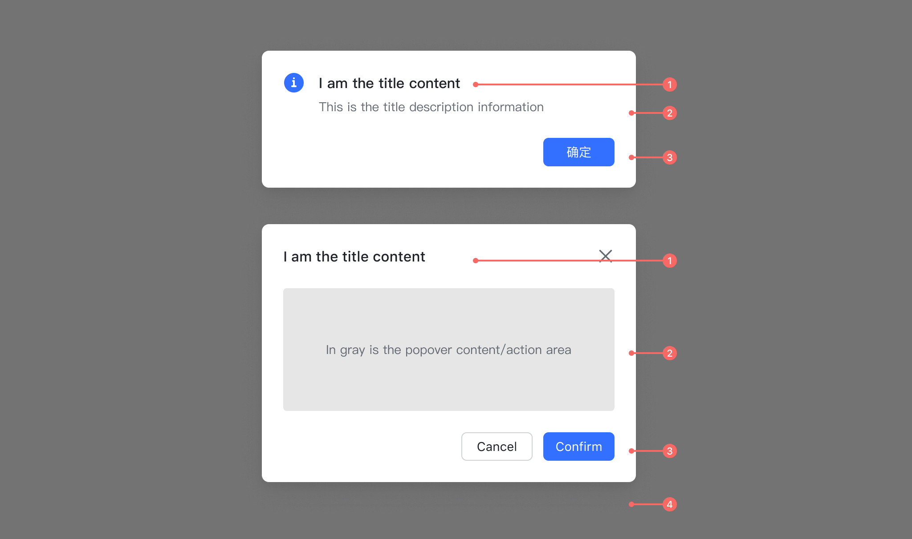 |
| --- |
| **对话框一般由3个部分组成：标题区、内容区、操作区** |\
||\
| 1. **标题区** |\
| 	1. **标题 ：** 标题区支持配置标题，标题应清晰传达当前模态弹窗的目的； |\
| 		 |\
| 	2. **描述 ：** 标题区支持配置描述，可以是简短的正文说明，也可以作为辅助信息展示； |\
| 		 |\
| 	3. **关闭 ：** 标题区支持操作右上角关闭按钮结束对话框； |\
| 		 |\
| 	4. **图标 ：**  |\
| 		- **基础对话框图标****\*****：** 标题区左侧支持配置4种状态的图标，一般用于通知对话框； |\
| 			 |\
| 		- **自定义对话框图标：** 标题区左侧支持自定义增加或取消图标的配置； |\
| 			 |\
| 2. **内容区** |\
| 	1. **内容 ：** 内容区按照业务需求展示对应信息，用于承载标题、按钮、单选框、复选框、列表、穿梭框等；如有卡片，需无投影； |\
| 		 |\
| 3. **操作区** |\
| 	1. **按钮：** 操作区支持配置是否存在、支持配置按钮文案及数量； |\
| 		 |\
| 4. **其他** |\
| 	1. **遮罩****\*****：** 对话框在 Z 轴上位于最高层，因此需要使用遮罩来表达空间上的绝对位置，并阻断其他内容对用户聚焦的干扰。 |
| - 默认配置图标；分为四种类型，分别是普通提示 info、成功提示success、警告提示warning、错误提示error。 |\
| 	 |\
||\
|  |

## 5-4. 标签页

**使用规则：** 

1. 需要对平级的区域进行收纳和展现时使用；
	
2. 需要在相关的内容组之间或是在相同层次结构中导航时使用。
	

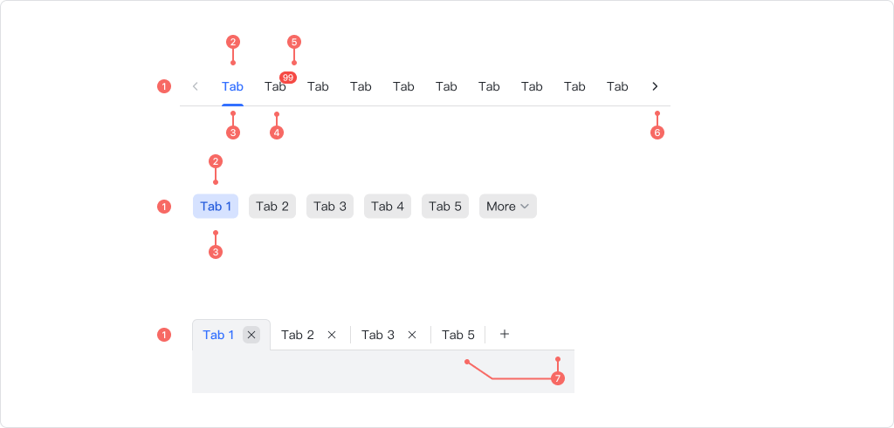
**组成要素：** 

1. **容器背景** 用于承载这个按钮的容器背景；
	
2. **标签页标题** 精简准确的文案（必要时可附带图标），表达此标签页中的内容；需要明确区分选中态和未选中态；
	
3. **选中态指示器（可选）** 高亮展示当前已选的标签页，有效区分页面模块；
	
4. **分割线****（可选）** 区分标签页与下方内容；
	
5. **徽标（可选）** 当功能模块更新、信息状态为未读、人员在线协同、信息量变化且无需告知具体数量或性质时，使用点状徽标突出状态，吸引用户注意；
	
6. **翻页按钮（可选）** ：当页面空间不足时，部分标签会出现溢出容器的情况，通过滑动按钮左右或上下滑动显示剩余标签；
	
7. **新增&关闭按钮（可选）** **：在支持定制标签页的场景下，可以通过新增和关闭按钮进行标签页的删减；**
	

**超长处理**

- 若标签页宽度超出容器：
	
- 设置滚动页签，将剩余页签放在翻页中；
	
- 剩余标签页收入“更多”中，Hover 展开下拉菜单进行选择。
	

1. **页签滚动**
	1. 页签交互形式：Icon button点击向后整体翻页,可滑动翻页。
		
	2. 页签滚动样式：多用于tab-line样式中。
		
		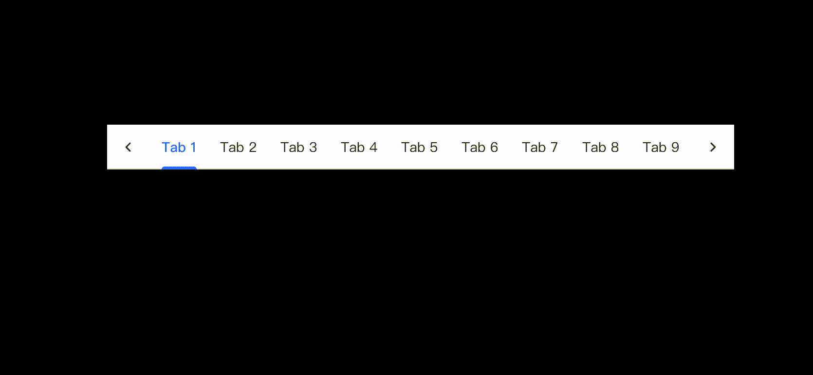
		
2. **页签替换**
	1. 将【更多】中的选中页签替换到 tab 选项末尾选项 ; 当点击其他任意非末尾选项时，列表的选项重制回到最初。当更多中Tabs的文本较长时，将替换原有标签中对应宽度数量的Tabs。
		
	2. 页签替换样式：多用于Tab-line和和Tab-capsule样式中。
		
		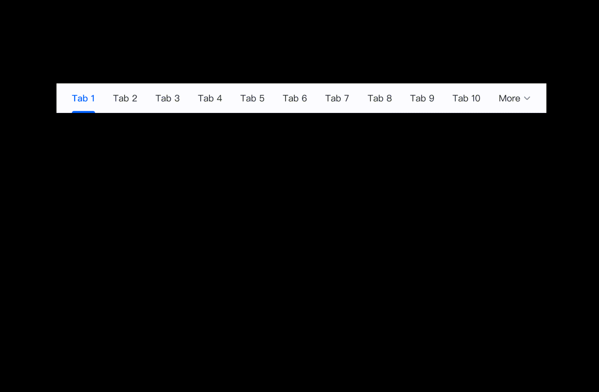
		

## 5-5. 加载态

加载态支持开放的主要分为两种类型：分别为骨架加载和 Spin 加载 ，详情可见[加载态 figma](https://www.figma.com/file/TMk9nXkW8oSR7aYmnZiMym/Bitable-%E5%BC%80%E6%94%BE%E7%94%9F%E6%80%81%EF%BC%88wip%EF%BC%89?node-id=1%3A4&t=88xK1i8vNDIsAbzw-1)

| **骨架屏** |  | - 界面有内容，且内容形态可预估的情况下优先使用； |\
||| 	 |\
||| - 仅用于初始的空页面加载； |\
||| 	 |\
||| - 推荐使用渐进式加载的方式：把内容按模块分割，加载完毕的模块立即显示，以减少等待时间。 |\
||| 	 |\
||||\
||||
| --- | --- | --- |
| **Spin 加载** | 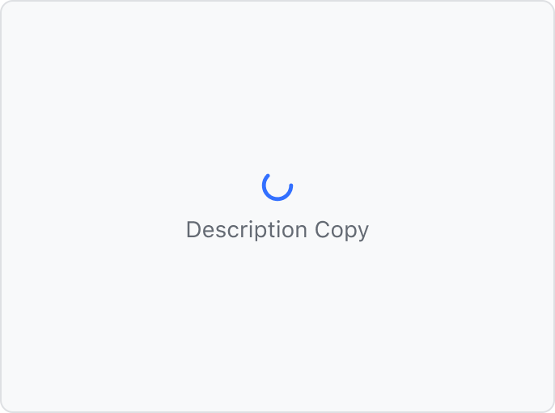 | - 用于较小的局部加载； |\
||| 	 |\
||| - 可用于使用中的状态切换加载（搜索联想、断网重连等）。 |\
||| 	 |\
||||\
||||

1. **骨架屏****设计**
	1. 抽象表现加载完成后的页面，但无需所有元素一一对应，可适当精简，以达到视觉美观；
		
	2. **色值：** 骨架屏为渐变色，起始色值为N900 5%，终止色值为N900 8%；
		
	3. **元素：** 包含头像、文本、图片，根据场景组合使用；
		- 头像骨架：尺寸、形状、位置与实际头像保持一致；
			
		- 图片骨架：尺寸、形状、位置与实际图片保持一致；
			
		- 文本骨架：高度建议与字号一致（eg：字号14px，则文本骨架高度14px），圆角Radius-XS（2px），可根据视觉效果进行调整。
			
		
		
2. **Spin 加载设计**
	1. **Spin 动效**：必选；
		
	2. **描述**：可选；通常不需要，情况复杂时可用来解释说明（eg：VC 会中断网重连）。
		
	3. **尺寸与布局：** Spin 默认提供两种尺寸。使用特殊尺寸时遵循 4N 规则，小尺寸可放宽到 2N；
		
	4. **小尺寸 24\*24px**：用于较小的局部加载，如图片、搜索联想、列表底部加载等。需要描述文案时，通常使用纵向排版，当上下高度不够时可使用横向排版。
		
	5. **大尺寸 40\*40px**：用于全局加载，通常是由于使用中状态切换造成的加载状态。需要描述文案时，使用纵向排版。
		
	6. 位置：在容器内居中显示
		
		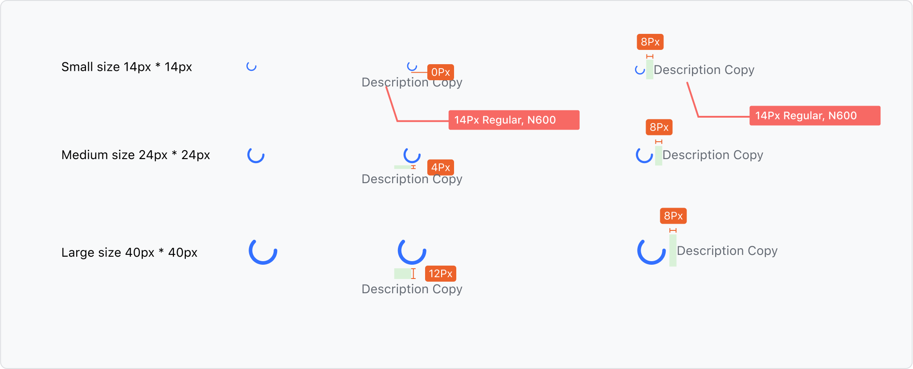
		
	7. **色彩：** 通常使用 B500；深色背景上使用 N00；灰色图片占位符上使用 N400。
		
		
		

<br>

## 5-6. 空状态

**使用规则**

- 在初始态、空数据状态、结果为空、错误态（无权限、404、500、租户停用、链接失效等）等状态下，利用示意图和文字描述，及时反馈为空信息给用户。
	
- 如有解决方案或引导方法，应在明显位置提供。
	
- 在整个较为复杂的交互动作完成后，给予用户的反馈。
	

**组成要素**
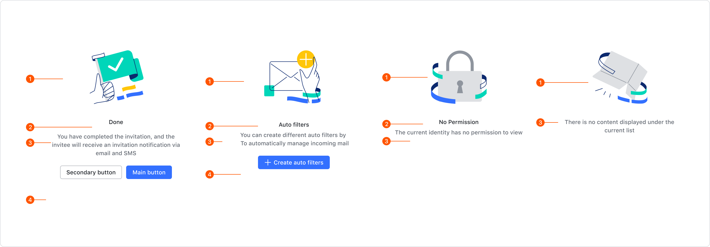

1. **插画（必要）**为空的情感化配图（规范中的插画只是示意，最终呈现以自己品牌插画为主）；
	
2. **标题（可选）**精简概要，短语、断句表达功能；
	
3. **描述（必要）**对其功能、内容的简单解释（如果整个空状态仅需插图，也可以省略该项）；任何空状态下都需要有相关场景的描述，包括 loading 和 正反馈
	
4. **按钮（可选）**行动按钮，建议优先使用「面性按钮」，如果同时存在主、次按钮，主要行动按钮在右侧。
	

<br>

**设计元素（尺寸、间距、字号、字色）**

- 插画：尺寸150\*150px，120px\*120px，60px\*60px
	
- 标题：字号16px，Meduim，N900，建议文案简短单行，使用短语或词组
	
- 描述：字号14px，Regular，N600，建议文案控制在一句话，完整句子需使用。建议最大宽度为插画的200%，即 250px。（如果只需要一行，优先使用副标题描述）
	
- 主按钮：按钮高度32px
	
- 文字按钮：字号14px
	
- 按钮排列顺序：优先同行左右展示按钮，当按钮一行排列不下时候，执行二行并列排列
	

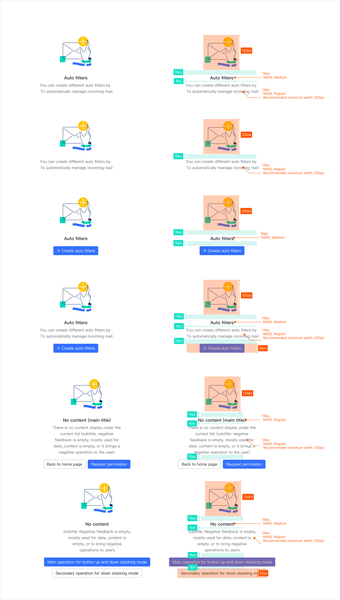
<br>

## 5-7. 选择器

相关设计请看 [选择器 figma](https://www.figma.com/file/TMk9nXkW8oSR7aYmnZiMym/Bitable-%E5%BC%80%E6%94%BE%E7%94%9F%E6%80%81%EF%BC%88wip%EF%BC%89?node-id=94%3A203340&t=fep6xoqWnuwEJ9iu-1)

用于在多个备选选项中选择一个合适的项目。选择器适用于时间、日期等备选选项多而密的场景。选择器是在多个选项列表中，选择单个或多个选项的控件。

1. **下拉选择器**：点击输入框，弹出一个下拉菜单给用户选择操作，如果下拉选项过多，则考虑使用其他控件承载。下拉选择器的状态包含了：常规状态、悬浮状态、选中状态、禁用状态。
	


2. **级联选择****器**：当用户需要从一组相关联的数据集合进行选择时可以采用此控件，在较大的数据集合中进行选择时，用多级分类进行分隔，方便选择。
	

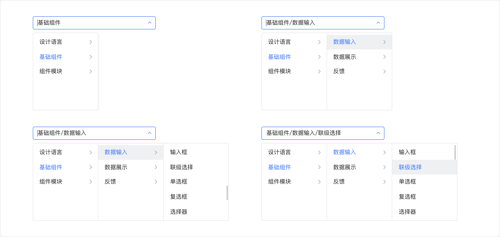

3. **日期选择器**：当用户需要输入一个日期，可以点击输入框，弹出时间面板进行选择。
	

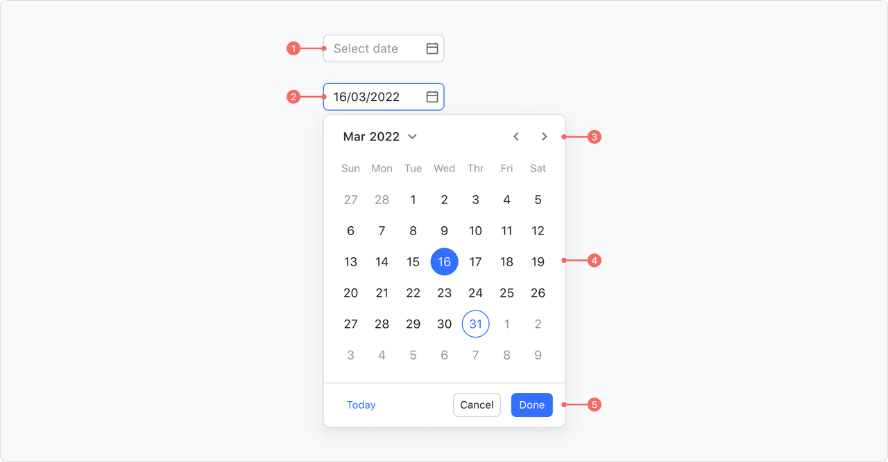
**日期选择器****一般由5个部分组成：触发器、日期输入区、导航区、日历面板、底栏**

- **触发器**
	- 提供了占位文案或提供一个默认时间。
		
	- 点击后唤起日历选择器，再次点击则收起。
		
- **日期输入区**
	- 唤起日历面板时默认聚焦在输入区，提供输入日期能力。
		
- **导航区**
	- 定位当前日历面板，可切换年/月。
		
	- 月份选择器：提供 12 个月份供选择。
		
	- 年份选择器：按需提供可选年份。
		
	- 左箭头：选择上一个月份。若当前所在月为该年的初始月（如 2018 年 1 月），将选择上一年最后一个月（即 2017 年 12 月）
		
	- 右箭头：选择下一个月份。若当前所在月为该年的最终月（如 2019 年 12 月），将选择下一年第一个月（即 2020 年 1 月）
		
	- 三角箭头：点击后展开年份面板，选择年份。
		
	- 下箭头：点击响应年份选择，年 / 月无交互行为时，下箭头需去除。
		
- **日历面板**
	- 星期展示：显示一周七天，不可交互。
		
	- 日期选项：今日日期项高亮标记，非本月的日期变灰来降低视觉重量，可按需求调整可选日期，如禁止选择部分日期。
		
- **底栏（可选）**
	- 可选配操作栏，按需增加快捷选项提高用户的操作效率，如放置「今天、明天、时间选择器、到期提醒」等选项。
		
	- 当需要增加一些常用选项时，如「最近一周」、「最近一月」可选用底栏进行选项外显；
		
	- 如外显常用选项过多超出面板宽度，此时应考虑使用选择框做选项收纳（ 参考使用示列）
		
	- 底栏间隔线采用通栏样式，以区分日期和选项操作，底部可根据业务需求搭配不同类型选项与选择框；当底栏出现多项有关联选项时，间隔线应使用非通栏样式 （ 参考使用示列）
		
	- 可搭配为「取消」与「确定」
		
	- 点击「取消」时，操作将中止，已完成输入的字段保持不变；
		
	- 点击「确定」时，日历面板将关闭，所选日期和时间将显示在触发器中。
		

<br>

4. **时间选择器**：当用户需要输入一个时间，可以点击输入框，弹出时间面板进行选择。
	

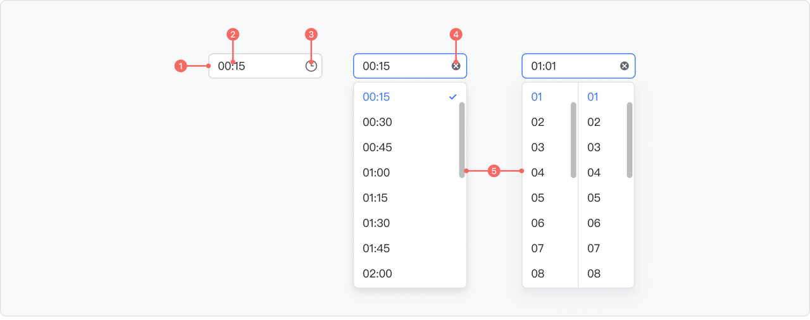

- **输入框****\***：输入框分为大、中、小三种尺寸，主要性质参照输入框组件。输入框的宽度可以由业务自定义；
	
- **时间****\***：时间为24小时制或12小时制。24小时制以 hh:mm 或 hh:mm:ss 的格式展现。例：24小时制展示 16:30；12小时制展示 下午 4:30（多语言根据语言习惯配置）；
	
- **时间icon**：时间icon作为输入框性质展示，建议展示。若容器尺寸过小可以隐藏；
	
- **清除键**：点击后清除已选时间数值；
	
- **下拉选择器****\***：分为两种类型，时和分合并选择，时和分独立选择。宽度可自定义，默认与输入框相同。
	

（**\****为必选项）*

## 5-8. 滚动条

1. **无滚动能力**
	1. 当不存在可滚动内容时 ，当前无滚动能力，则不显示滚动条。
		
2. **有滚动能力**
	1. 当内容的高度或宽度超过视窗区域后，具有滚动能力，滚动条显示规则如下：
		
	2. 遵循「系统偏好设置」，判断「滚动时」或「始终」显示滚动条。
		- 备注：若业务线评估遵循「系统偏好设置」的研发成本过高且ROI低，可考虑优先遵循「始终显示」的显示逻辑。
			
		
		|  | **Mac设置** | **Windows设置** |
		| --- | --- | --- |
		| **设置截图** |  |  |
		| **滚动时显示** | 根据鼠标或触控板自动显示——使用触控板时 | 自动隐藏滚动条——开 |\
		|| 滚动时 ||
		| **始终显示** | 根据鼠标或触控板自动显示——使用鼠标时 | 自动隐藏滚动条——关 |\
		|| 始终 ||
		
	3. **滚动时显示**
		- 当系统偏好设置为「滚动时显示」滚动条时，则所有面板均在滚动时显示滚动条；
			
		- 当鼠标 Hover 到视窗内时，滚动条也需显示让用户知道内容可滚动。
			
	4. **始终显示**
		- 当系统偏好设置为「始终显示」滚动条时，滚动条在「当前活跃面板中」显示，包括以下两种情况：
			- **常驻显示****滚动条****：** 用于明确的用户当前聚焦的面板。如模态弹窗、单面板的页面。
				
			- **仅在当前活动视窗显示****滚动条**：用于多面板且用户滚动目标不明确的场景。当指针移出该视窗或停止快捷键滚动该视窗后，隐藏滚动条。
				

| **滚动条****样式：**  |\
| **尺寸规则：** Thumb热区宽度为11px（包括滚动条可见宽度7px，四周2px的padding），限制最小高度为24px（包括滚动条可见高度20px，上下各2px的padding）； |\
||\
| - Track宽度为11px，与Thumb热区宽度重合。 |
| --- |
| 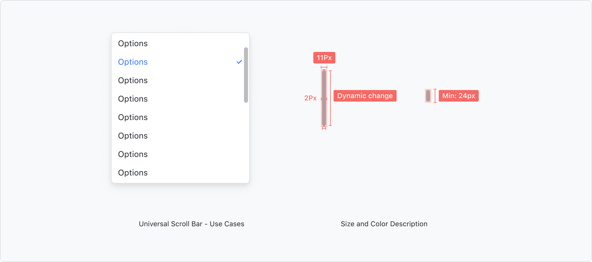 |
| **状态与颜色：** 滚动条有normal、hover、pressed的状态，仅颜色变化，尺寸不变，指针捕获使用Pointer（黑箭头） |\
||\
| - 注意：使用滚动/滑动/快捷键滚动、指针没有悬停在滑块上时，滚动条始终显示为normal态。 |
| 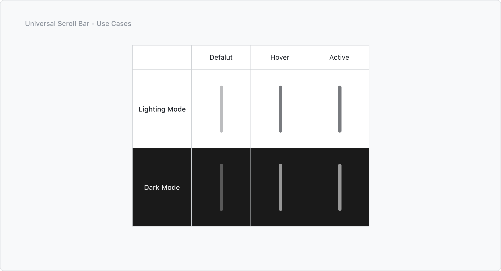 |

# 六、设计资源文件

暂时无法在飞书文档外展示此内容